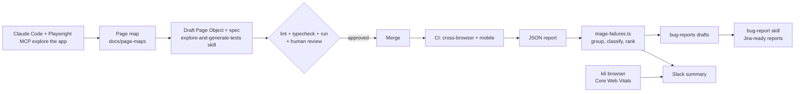

# AI-driven testing workflow

How this suite uses AI agents (Claude Code + the Playwright MCP server) from exploring a page
to a ranked, Jira-ready defect list. Everything runs against the public demo site
https://www.saucedemo.com; no proprietary code or data is involved.



## What the AI does, and what stays human

| Step | AI (agent) | Human |
| --- | --- | --- |
| Explore the page | Navigates, snapshots, interacts through MCP | Chooses what to cover |
| Page map and draft tests | Writes them from what it observed | Reviews every generated test before merge |
| Verification | Runs lint, typecheck and the new spec | Decides what is worth keeping |
| Triage | Deterministic script groups and ranks failures | Owns the severity rubric |
| Bug reports | Drafts reproduction, expected/actual, evidence | Files it in Jira and owns the decision |

## Components

| Piece | Where | Notes |
| --- | --- | --- |
| Exploration and test generation | `.claude/skills/explore-and-generate-tests/` | Claude Code skill; drives the MCP server from `.mcp.json` |
| Defect triage | `scripts/triage-failures.ts` | Deterministic (no LLM): reproducible and unit-testable |
| Bug report writing | `.claude/skills/bug-report/` | Claude Code skill; refines the drafts |
| Performance | `perf/k6/`, `.github/workflows/performance.yml` | k6 browser module, Core Web Vitals thresholds |
| Reporting | `scripts/k6-summary.ts`, workflow steps | Slack via an incoming-webhook secret (optional) |

## Try the triage without running the suite

```bash
npm ci
npm run triage:example      # reads scripts/__fixtures__/sample-results.json
ls bug-reports/             # BUG-001-*.md ... summary.md slack-payload.json
```

Committed sample output: [`docs/examples/bug-reports/`](examples/bug-reports/). It was generated
from a synthetic fixture (not from real failures) to show the format.

## Severity rubric

| Category | Base severity | Rule |
| --- | --- | --- |
| Functional on a core flow (login, cart, checkout) or `@smoke` | Critical | |
| Other functional, network resilience | Major | |
| Accessibility, performance | Medium | |
| Visual | Minor | |
| Flaky (passed on retry) | Low | Never bumped |

Failing in 3 or more projects (browsers/devices) raises the severity by one level.
Different tests failing with the same normalised error are flagged as a likely single root cause.

## Slack

Set the repository secret `SLACK_WEBHOOK_URL` (an incoming webhook). Without it the workflows
still run and simply skip the notification. The Playwright workflow posts on failures and on the
nightly run; the performance workflow posts its result every run.

## Limitations

- The skills are instructions for Claude Code: output quality depends on the model and on review.
- Triage is heuristic. The rubric is explicit so it can be argued with and changed.
- `performance.yml` (k6 browser) is written against the k6 browser module but has not been run
  in CI yet; run it once with **Run workflow** and adjust `perf/k6/thresholds.json` to what the
  site really delivers before trusting the gate.
- SauceDemo is a static demo app: page-load numbers here demonstrate the method, not a benchmark.
